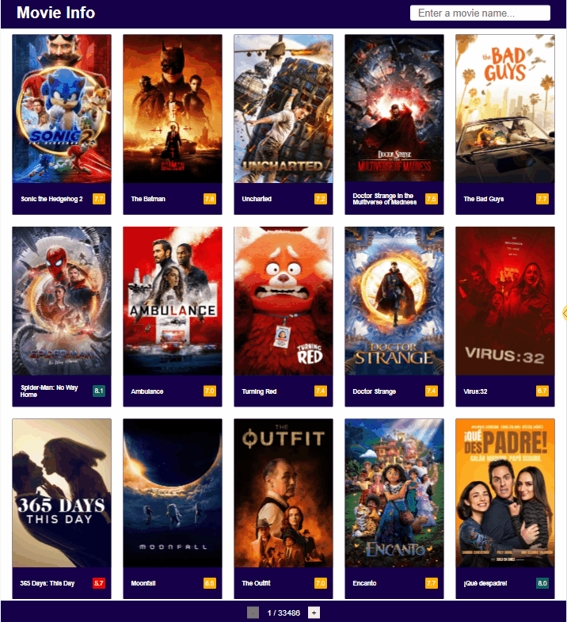

# movie-info

Movie info app created as a personal project.

# [🔗 View Deployed Application](https://hoang0211.github.io/movie-info/)

## Table Of Contents

- [Application Features](#Application-Features)
- [Technologies Used](#Technologies-Used)
- [Future Additions](#Future-Additions)

---

## Application Features

A front-end application built from scratch. The application serves as a movie info web that allows users to find information about latest movies.

### Requirements

- Simple to use interface.
- Navigate between pages.
- Search for movie by name.
- See movies info by mouse over.
- Responsive application layout.

  

[Back To Top](#Table-Of-Contents)

---

## Technologies Used

This project gets data from TheMovieDB API and is deployed using GitHub Pages.

- React.js
- CSS Modules

[Back To Top](#Table-Of-Contents)

---

## Future Additions

[Back To Top](#Table-Of-Contents)
